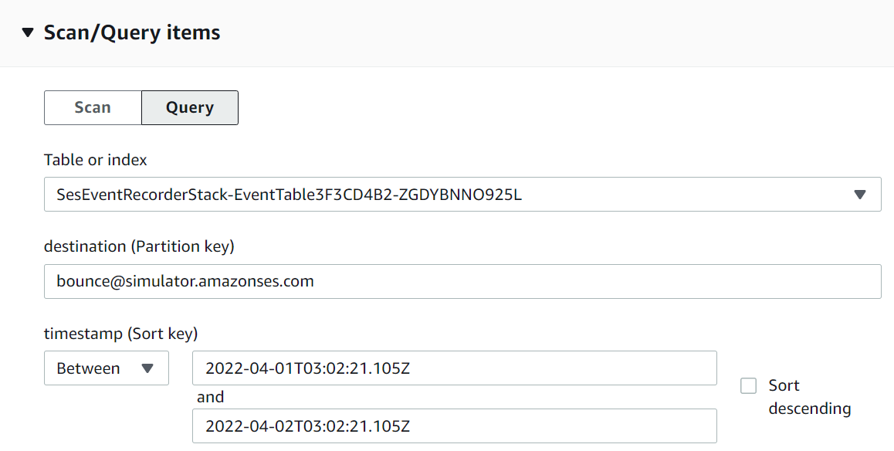
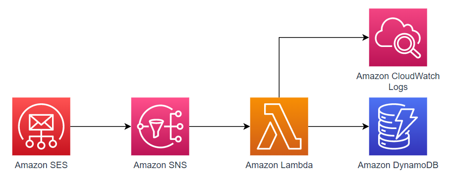
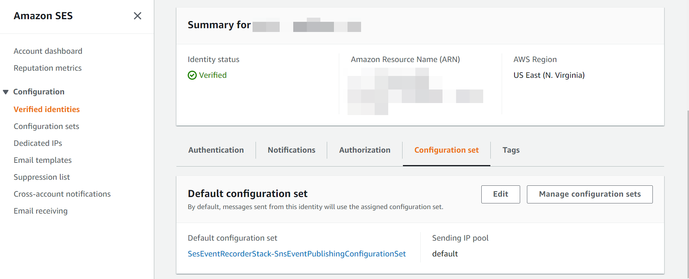
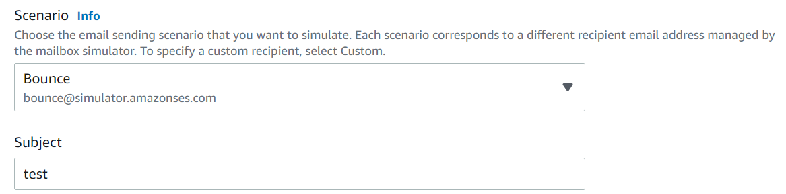
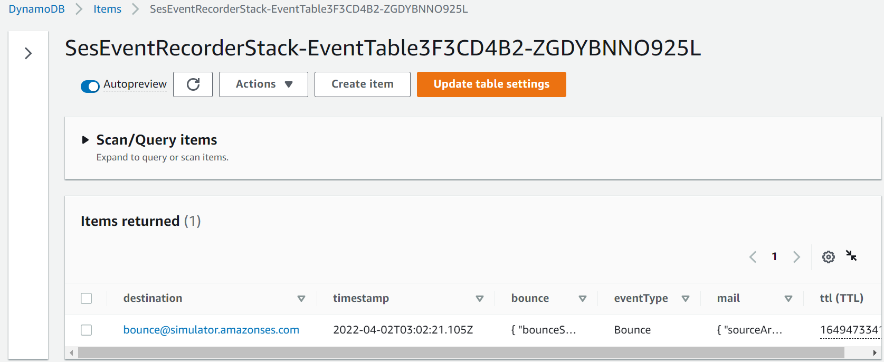

# SES Event Recorder

Publish AWS SES events to AWS DynamoDB table so you can see the delivery details of your email.

You can query your email events by recipient email address and a time range.



## Architecture



- SES Event Publishing will be used to publish selected events to SNS.
  - By default the selected event types are `REJECT,BOUNCE,COMPLAINT`, you can customize it by using CDK/CloudFormation parameters.
- Lambda will save the full records to DynamoDB.
  - You can customize the lambda handler code to make those records smaller.
  - Raw event will be logged into CloudWatch Logs and be retained for 1 day.
- DynamoDB is used to query your SES events.
  - The destinations/recipients of the email is the partition key of DynamoDB, and the timestamp of the email is the sort key.
    - If a email contains multiple destinations, multiple item will be created in DynamoDB.
    - By this design, you can query your email events by recipient email address and a time range.
  - DynamoDB TTL attribute is set to control the size of the table. TTL is 7 days by default, you can customize it by using CDK/CloudFormation parameters.

## Prerequisites

- [Node.js](https://nodejs.org/en/) is installed.
- [AWS credentials are configured.](https://docs.aws.amazon.com/cli/latest/userguide/cli-configure-files.html)

## Deploy

```bash
# install aws cdk
npm install -g aws-cdk

# download source code
git clone https://github.com/DiscreteTom/ses-event-recorder.git
cd ses-event-recorder

# install dependencies
npm install

# prepare cdk environment
cdk bootstrap

# deploy this project
cdk deploy
```

After those above, you will see a new SES Configuration Set. Set that Configuration Set to the default Configuration Set of you Verified Identities.



Then, send a test email using `Bounce` type:



Now you can find your bounce event details in DynamoDB:



## Clean Up

```bash
cdk destroy
```
